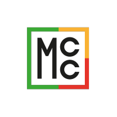

### Techs
* I know well:
`C#` `.NET` `ASP.NET Core` `EF` | `PostgreSQL` `Pl/SQL` `Pl/pgSQL` | `TS` `React` | `Git` | `REST` | `UML`
* I know: `Docker` | `PowerShell` `Bash` | `Ubuntu` | `SCSS` `CSS Modules` | `gRPC` | `BPMN`
* I had deal with: `.NET Framework` `EF 6` | `OpenSearch` | `JQuery` | `Vue 2` | `Less` 
* I know and hate: `CSS` `HTML` `JS`
* Techs I want to know: `Rust` | `MongoDB` `SurrealDB` | `Message brokers` `k8s` `Microservices`

### Work experience:

**Full-stack** \
[**MCC Soft**](https://github.com/mccsoft) • August 2022 - ... \
Techs: `C#` `.NET` `ASP.NET Core` `EF` `PostgreSQL` `OpenSearch` `React` `TS` `SCSS` `CSS Modules` \
 

**Full-stack** \
[**ГК Инком**](https://incom.tomsk.ru/) • June 2021 - May 2022 \
Techs: `C#` `.NET Framework` `ASP.NET MVC` `EF 6` `PostgreSQL` `JQuery` `JS` `Less` `Kendo UI` \
 
